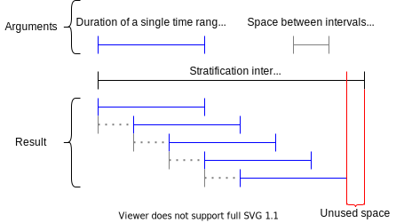
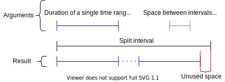
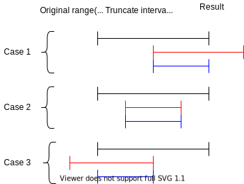
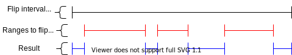

# Time Ranges [](https://pkg.go.dev/github.com/cappuccinotm/trn) [](https://github.com/cappuccinotm/trn/actions/workflows/go.yaml) [](https://codecov.io/gh/cappuccinotm/trn) 
Package `trn` introduces a `Range` type with useful methods to perform complex
operations over time ranges.

## Install and update
`go get -u github.com/cappuccinotm/trn`

## Usage
```go
rng := trn.New(time.Now(), 3 * time.Hour, trn.In(time.UTC))

betweenRng := trn.Between(time.Now(), time.Now().Add(3 * time.Hour), trn.In(time.UTC))
```

For more examples see [test file](examples_test.go).

## Todo
- [ ] Make UTC and opts tests work in UTC location

## Methods
- `func New(start time.Time, duration time.Duration, opts ...Option) Range`
  
  Creates a new `Range` with start at the given time and with the given duration.

- `func Between(start, end time.Time, opts ...Option) (Range, error)`

  Creates a new `Range` within the given time range. `Between` uses the location
  of the `start` time for the range.
  Returns ErrStartAfterEnd if the start time is later than the end.

- `func (r Range) Stratify(duration time.Duration, interval time.Duration) ([]Range, error)`
  
  Slices the range into smaller ones with fixed `duration` and fixed `interval` 
  between their **starts**.
  In case if the last interval doesn't fit into the given duration, `Stratify` 
  won't return it.
  Returns ErrZeroDurationInterval if the provided duration or interval is less or equal to zero.

<details><summary>Illustration</summary>



</details>

- `func (r Range) Split(duration time.Duration, interval time.Duration) ([]Range, error)`

  Slices the range into smaller ones with fixed `duration` and fixed `interval` 
  between the **end** of the one range and **start** of next range.
  In case if the last interval doesn't fit into the given duration, `Split` 
  won't return it.
  Returns ErrZeroDurationInterval if the provided duration is less or equal to zero.

<details><summary>Illustration</summary>



</details>

- `func (r Range) Truncate(bounds Range) Range`
  
  Cuts the start and the end of the range to fit the given `bounds`.

<details><summary>Illustration</summary>



</details>

- `MergeOverlappingRanges(ranges []Range) []Range`
  
<details><summary>Illustration</summary>


</details>

- `func (r Range) Flip(ranges []Range) []Range`

  Flips the given `ranges` within the given period (`r`).
  
  The boundaries of the given ranges are considered to be inclusive, which means
  that the flipped ranges will start or end at the exact nanosecond where
  the boundary from the input starts or ends.

  Note: for the sake of safety, ranges are being merged before flip to ensure 
  the correct working of method.

<details><summary>Illustration</summary>



</details>

- `func Intersection(ranges []Range) Range`

  Returns the range, which is common for all the given ranges.

<details><summary>Illustration</summary>


</details>

There are some other non-algorithmic methods, which you can see in the [reference](https://pkg.go.dev/github.com/cappuccinotm/trn).

## Details

`String` method formats the range in format `[start time, end time]`, where the 
times are formatted with the next template:
```go
const defaultRangeFmt = "2006-01-02 15:04:05.999999999 -0700 MST"
```

# Status
The code was extracted from existing project and still under development. Until 
v1.x released the API may change.
